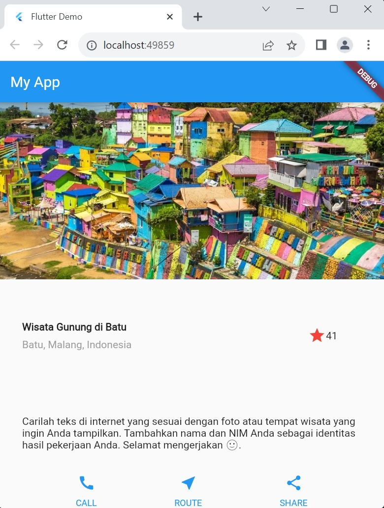

# Nama   : Yisha Zukhrufin A
# Kelas  : TI-3A
# No.Abs : 30
# Nim    : 2141720013

Layout dan Navigasi

## Praktikum 1
- langkah 1: Buka Project Baru
- langkah 2: Buka file lib/main.dart

    Buka file main.dart lalu ganti dengan kode berikut. Isi nama dan NIM Anda di text title.

    
- langkah 3 : Identifikasi Layout Diagram

    1. Identifikasi baris dan kolom.
    2. Apakah tata letaknya menyertakan kisi-kisi (grid)?
    3. Apakah ada elemen yang tumpang tindih?
    4. Apakah UI memerlukan tab?
    5. Perhatikan area yang memerlukan alignment, padding, atau borders.
- langkah 4: Implementasi Tittle Row

    Pertama, Anda akan membuat kolom bagian kiri pada judul. Tambahkan kode berikut di bagian atas metode build() di dalam kelas MyApp:
    

    1. Letakkan widget Column di dalam widget Expanded agar menyesuaikan ruang yang tersisa di dalam widget Row. Tambahkan properti crossAxisAlignment ke CrossAxisAlignment.start sehingga posisi kolom berada di awal baris.
    2.  Letakkan baris pertama teks di dalam Container sehingga memungkinkan Anda untuk menambahkan padding = 8. Teks ‘Batu, Malang, Indonesia' di dalam Column, set warna menjadi abu-abu.
    3.  Dua item terakhir di baris judul adalah ikon bintang, set dengan warna merah, dan teks "41". Seluruh baris ada di dalam Container dan beri padding di sepanjang setiap tepinya sebesar 32 piksel. Kemudian ganti isi body text ‘Hello World' dengan variabel titleSection 
    
    
    
    
    
## Praktikum 2
- Langkah 1: Buat method Column _buildButtonColumn

    Anda dapat mencari gambar di internet yang ingin ditampilkan. Buatlah folder images di root project layout_flutter. Masukkan file gambar tersebut ke folder images, lalu set nama file tersebut ke file pubspec.yaml seperti berikut:

- langkah 2: Buat Widget buttonSection

    Buat Fungsi untuk menambahkan ikon langsung ke kolom. Teks berada di dalam Container dengan margin hanya di bagian atas, yang memisahkan teks dari ikon.

- lagkah 3: Tambah Button Section ke body

    Tambahkan variabel buttonSection ke dalam body 

 hasil output
 

## Praktikum 3
- Langkah 1: Buat Widget textSection

    Tentukan bagian teks sebagai variabel. Masukkan teks ke dalam Container dan tambahkan padding di sepanjang setiap tepinya. Tambahkan kode berikut tepat di bawah deklarasi buttonSection:

- Langkah 2: Tambahkan Variabel Text Section ke body

    Tambahkan widget variabel textSection ke dalam body seperti berikut:
 
 hasil output:
 

## Praktikum 4
- Langkah 1: Siapkan Assets gambar

    Anda dapat mencari gambar di internet yang ingin ditampilkan. Buatlah folder images di root project layout_flutter. Masukkan file gambar tersebut ke folder images, lalu set nama file tersebut ke file pubspec.yaml seperti berikut:

- Langkah 2: Tambahkan Gambar e Body

    Tambahkan aset gambar ke dalam body seperti berikut:

- Langkah 3: Ubah menjadi ListView

    Pada langkah terakhir ini, atur semua elemen dalam ListView, bukan Column, karena ListView mendukung scroll yang dinamis saat aplikasi dijalankan pada perangkat yang resolusinya lebih kecil.

hasil output:

